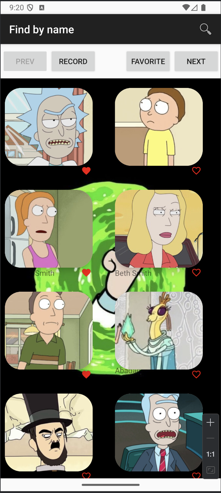
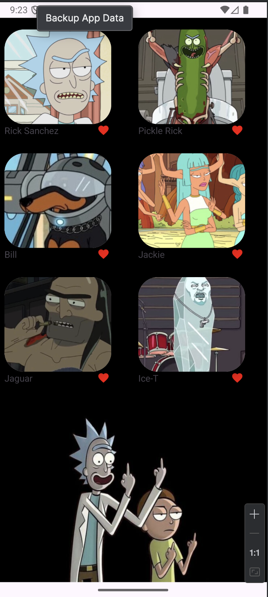
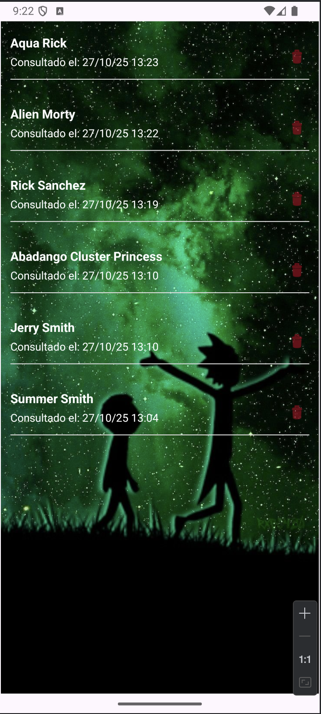
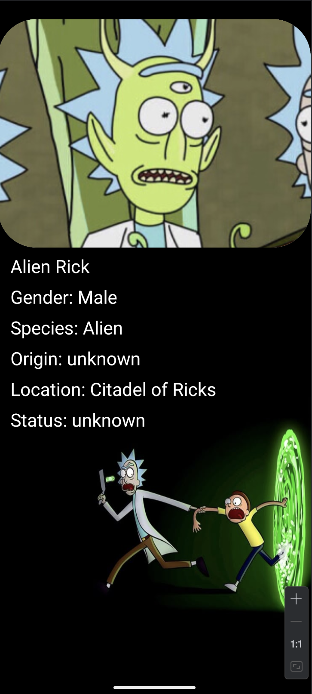

# 🌌 Rick & Morty Explorer 🚀
### Aplicación de Consulta y Persistencia de Personajes con Arquitectura Moderna


## 📝 Descripción del Proyecto

Esta es una aplicación móvil desarrollada en **Kotlin** para Android que permite a los usuarios explorar la vasta lista de personajes del universo de Rick y Morty, obteniendo sus detalles y gestionando datos de forma local.

El proyecto se enfoca en aplicar principios de arquitectura moderna (**MVVM**), persistencia de datos y la inyección de dependencias para crear una aplicación modular, escalable y fácil de mantener.

## ✨ Características Destacadas

| Característica | Implementación |
| :--- | :--- |
| **Catálogo Interactivo** | Lista dinámica de personajes con paginación (`PREV`/`NEXT`). |
| **Búsqueda Dinámica** | Funcionalidad de búsqueda en tiempo real por nombre de personaje. |
| **Persistencia (Favoritos)** | Almacenamiento local de personajes favoritos usando la base de datos **Room**. |
| **Historial de Consultas** | Registro automático de cada personaje consultado con fecha y hora. |
| **Navegación Eficiente** | Uso de Patrones de Arquitectura para una navegación clara y reactiva. |

## 🛠️ Tecnologías y Arquitectura

El proyecto está construido bajo el patrón de arquitectura **MVVM (Model-View-ViewModel)** y utiliza las siguientes librerías clave:

| Categoría | Librería | Propósito |
| :--- | :--- | :--- |
| **Base de Datos** | **Room** | Persistencia de favoritos y registros de consulta. |
| **Networking** | **Retrofit** | Cliente HTTP para consumir la API de Rick and Morty. |
| **Asincronía** | **Coroutines & Flow** | Gestión de operaciones en segundo plano y flujos de datos reactivos. |
| **Inyección de Dependencias** | **Hilt (Dagger)** | Gestión del ciclo de vida y provisión de dependencias. |
| **Imágenes** | **Picasso** | Carga y gestión eficiente de imágenes. |

## 📲 Pantallas de la Aplicación

### 1. Lista Principal y Búsqueda
La pantalla de inicio permite navegar por el catálogo completo, buscar personajes y acceder a las secciones de Favoritos y Registro.

| Vista de Lista | Vista de Búsqueda |
| :---: | :---: |
|  |  |

### 2. Gestión de Favoritos
Sección dedicada a los personajes marcados como favoritos, persistidos en la base de datos local.



### 3. Historial de Registros
Registro cronológico de todas las consultas realizadas, demostrando la capacidad de la aplicación para guardar datos complejos.


### 4. Vista de Detalle
Detalle de cada personaje de la serie Rick y Morty.



## ⚙️ Instalación y Uso

Para clonar y ejecutar este proyecto localmente, sigue estos pasos.

### Requisitos

* Android Studio (Versión Arctic Fox o superior).
* Un dispositivo o emulador con **Android API 28 (Mínimo) o superior**.
* Conexión a Internet para la descarga inicial de dependencias y la consulta a la API.

### Pasos

1.  **Clonar el repositorio:**
    ```bash
    git clone [https://www.youtube.com/watch?v=eQMcIGVc8N0](https://www.youtube.com/watch?v=eQMcIGVc8N0)
    ```
2.  **Abrir en Android Studio:**
    Abre la carpeta raíz del proyecto en Android Studio.
3.  **Sincronizar Gradle:**
    Espera a que Gradle sincronice todas las dependencias (Hilt, Room, Retrofit, etc.).
4.  **Ejecutar:**
    Selecciona un dispositivo o emulador y haz clic en el botón `Run 'app'` (el icono de play verde).